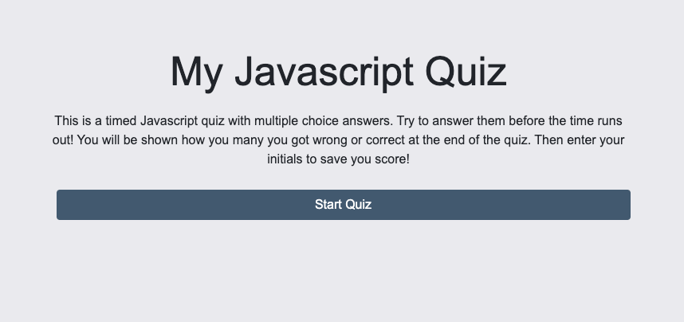
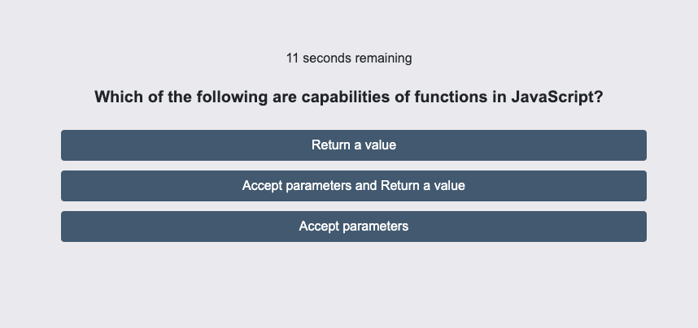
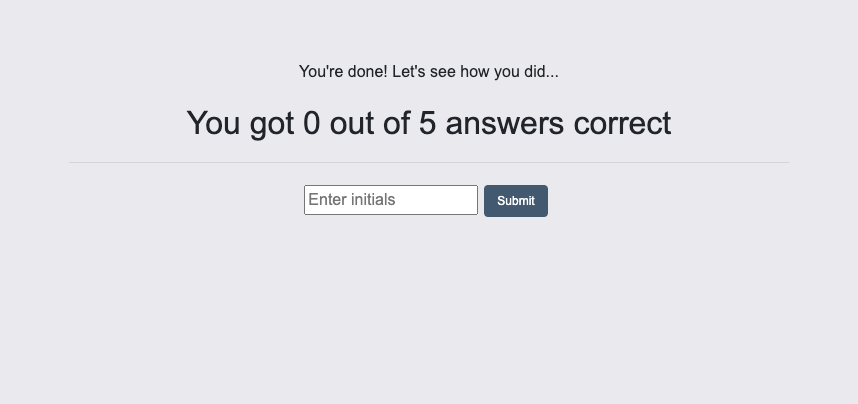

# TimedQuiz Description

This a multiple choice timed quiz in Javascript.

The user is prompted with 5 multiple choice questions with a theme based on Javascript code.

There is a 30 second timer for all 5 questions. Whether the timer expires or all of the questions were answered, there is a final score consisting of how many questions were answered correctly and the user is then presented with an input field for their initials so that they can save their score to the high scores list. 

(Unfortunately, I was not able to get this last part built due to time constraints).

# Link to deployed application

https://evadllewop.github.io/TimedQuiz/

# Screenshot of deployed application

